# 在线教育平台

后端采用`Spring Cloud`，前端采用`Vue` 3，存储采用`Mysql`，缓存采用`Redis`。完成基本的考试功能。完成了遗传算法自动组卷、文本批量导入题库，邀请码加入课程、数据可视化等一系列前后端功能。

## 介绍

###  项目地址

#### 前端：

#### 后端：

### 系统截图

<table>
    <tr>
        <td>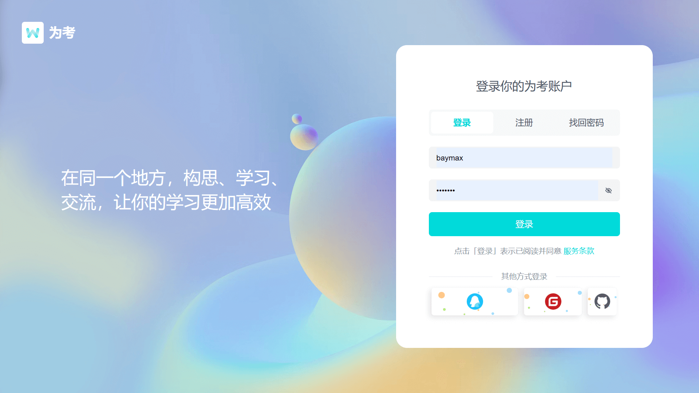</td>
        <td></td>
         <td>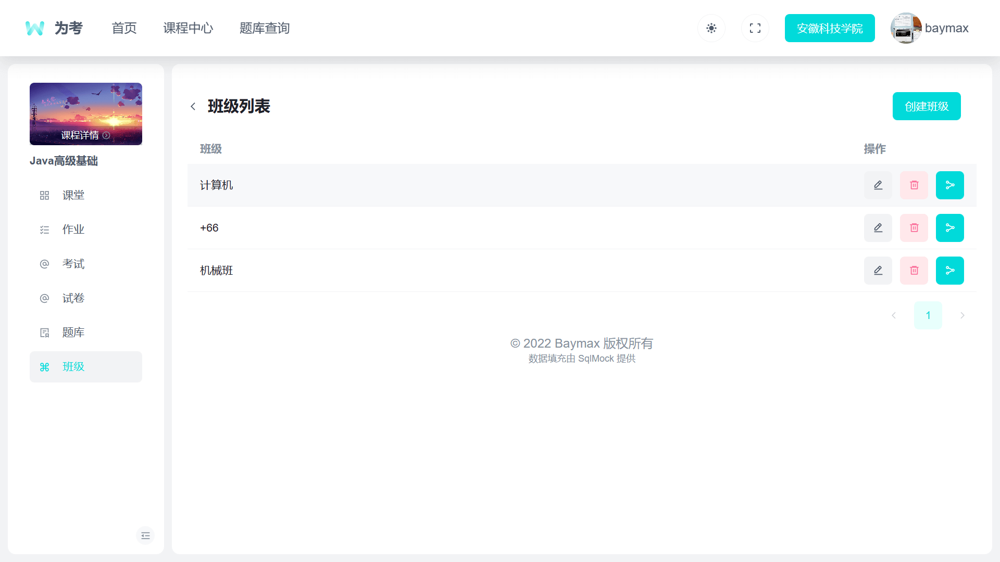</td>
         <td>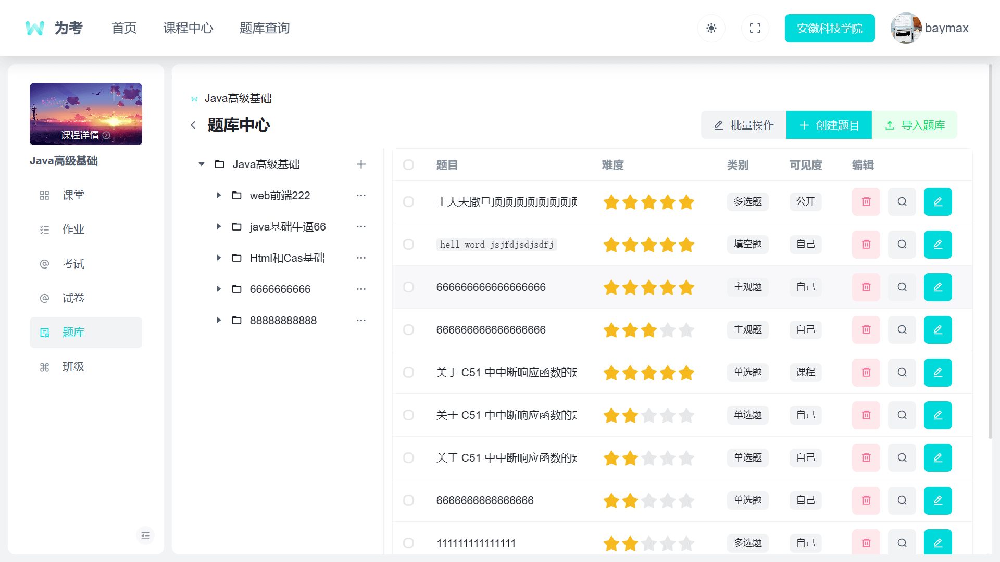</td>
    </tr>
    <tr>
        <td>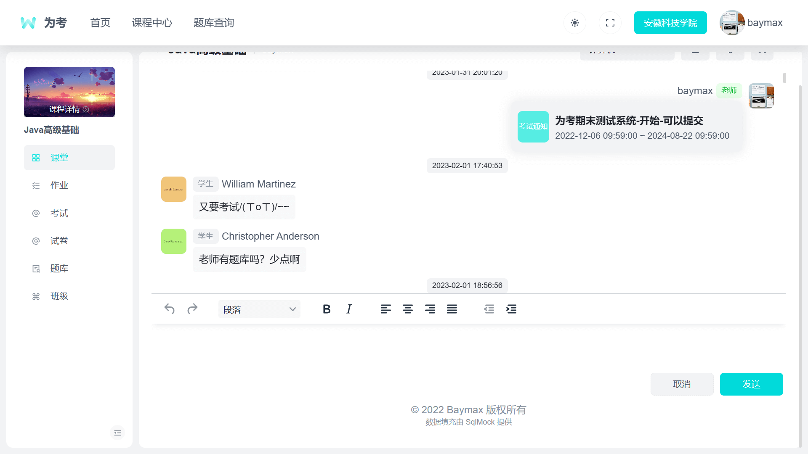</td>         
        <td>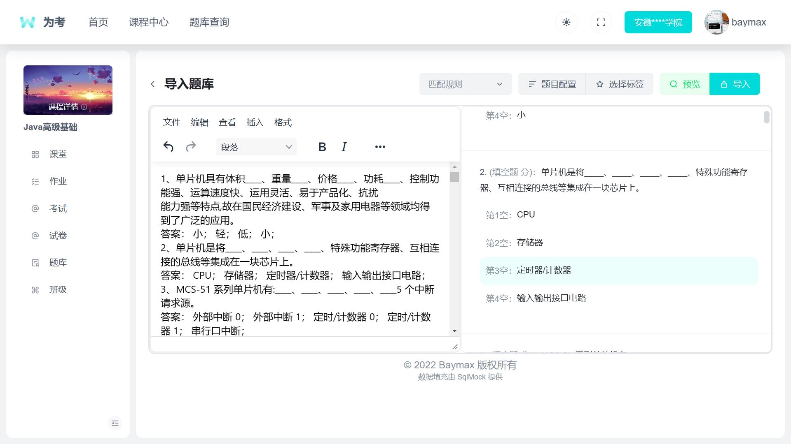</td>
         <td>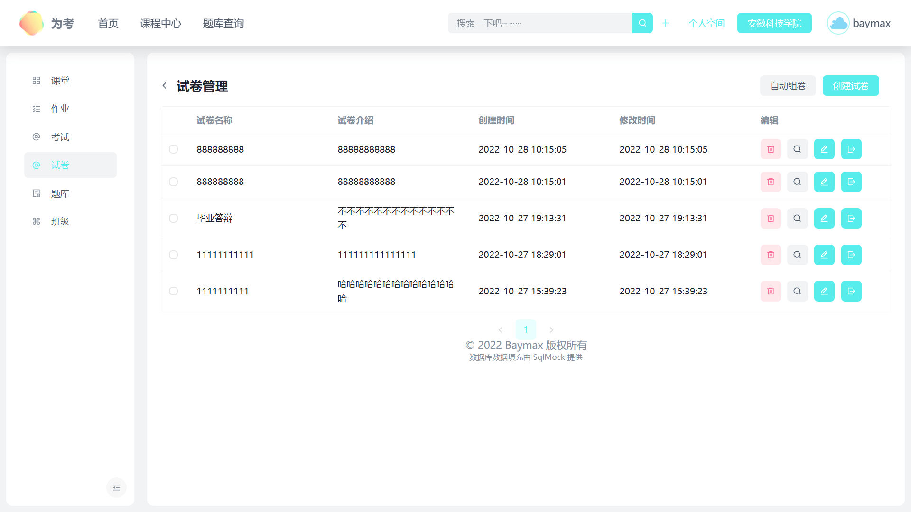</td>
         <td>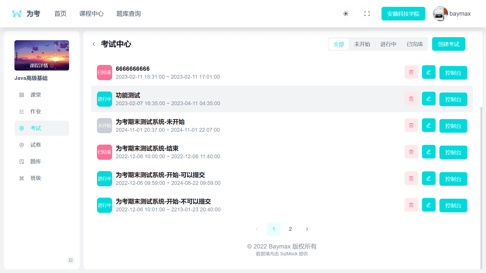</td>
    </tr>
    <tr>
        <td>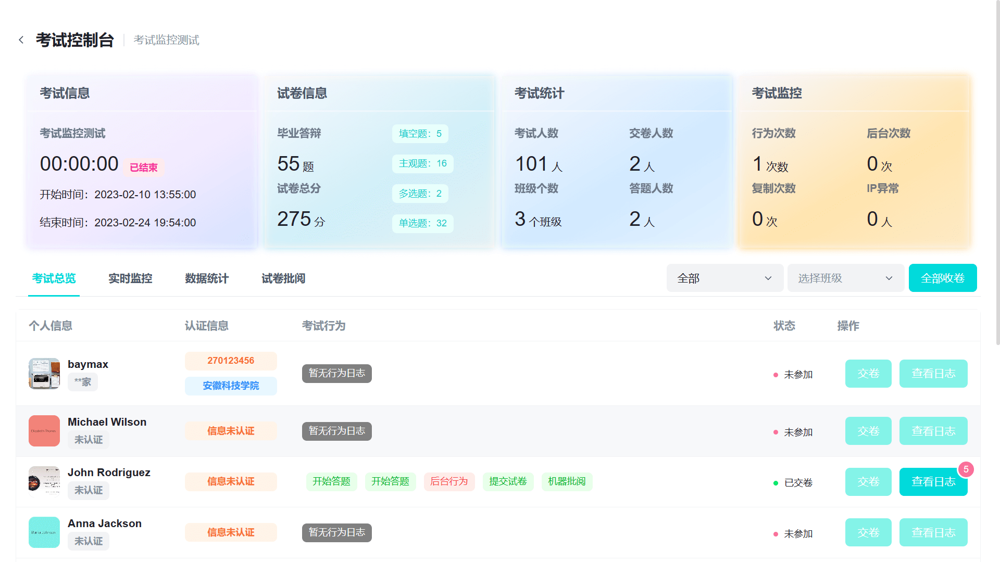</td>
        <td>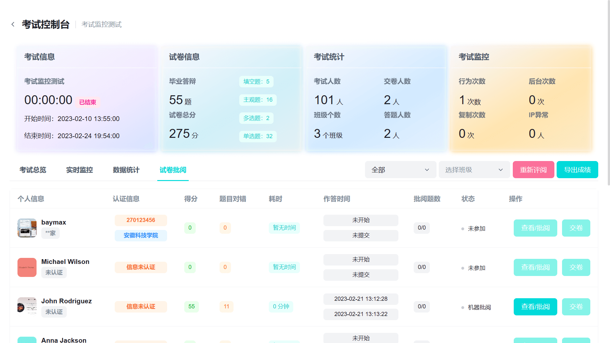</td>
         <td>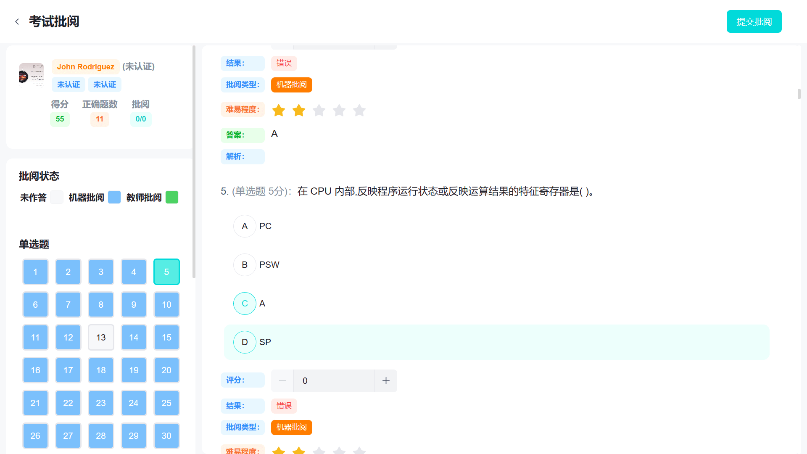</td>
         <td>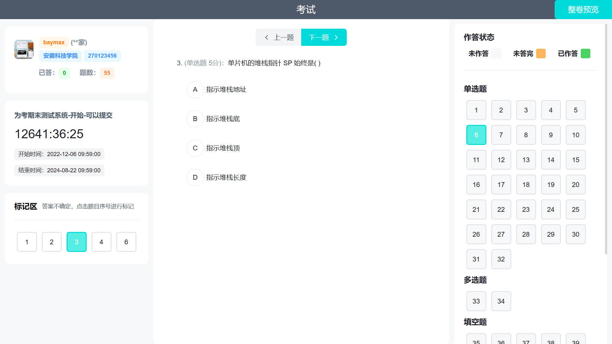</td>
    </tr>
     <tr>
        <td>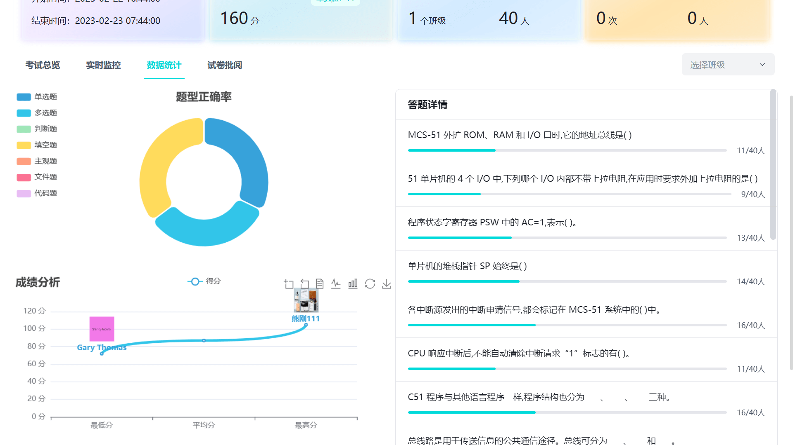</td>
        <td>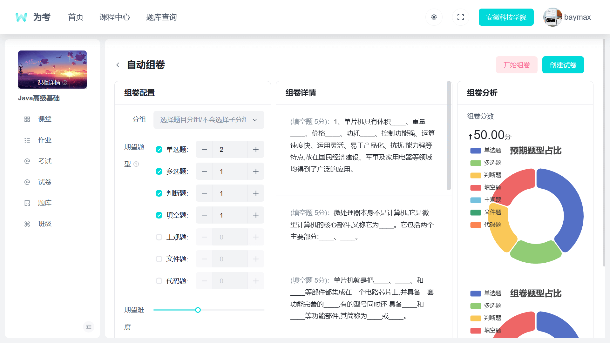</td>
        <td>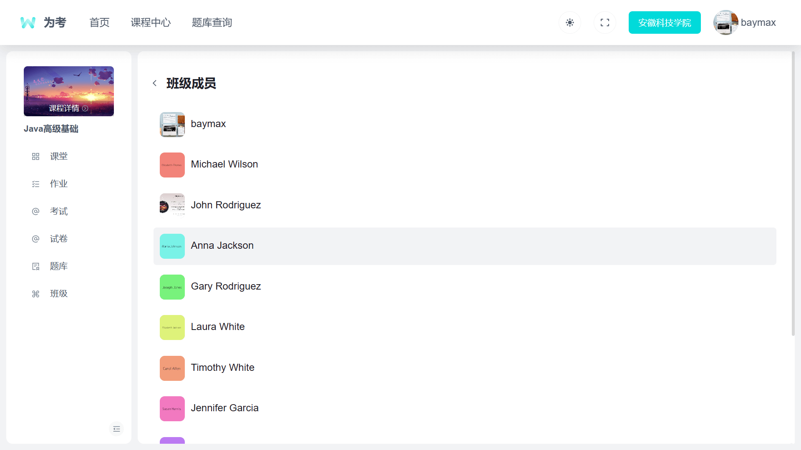</td>
    </tr>
</table>
### 系统

- 框架：SpringBoot、SpringCloud、Mybatis Plus、WebSocket
- 数据库：Mysql
- 缓存：Redis
- 前端：Vue 3、Vite、Pinia、Arco UI

### 完成功能

- [x] 创建课程、添加课程、班级码加入课程
- [x] 创建班级、查看班级用户、分享班级码
- [x] 课堂互相实时聊天
- [x] 创建题库、题库树形分类
- [x] 创建题目（单、多、判、填、主观）、修改题目选项
- [x] 创建试卷、修改试卷、手动组卷、遗传算法自动组卷
- [x] 创建考试、修改考试
- [x] 考试控制台、考试概览、老师批阅、数据统计、考试监控
- [x] 参加考试
- [x] 行为监控
- [x] 实时消息通知
- [x] 考试数据导出
- [x] 考生数据统计分析

# 智慧学堂-前端
## 功能说明
### 登录

由于注册功能使用的是邮箱注册登录，在本地测试下如果没有配置邮箱功能，就不能注册，如需测试使用，请使用：

```text
用户名：baymax  密码：s123456
用户名：Steven 密码：s123456
用户名：Scott ：密码：s123456
```

### 课程中心

主页面只有我的课程是完成的，我的作业 我的考试 我的笔记 消息那些功能都没写

### 个人中心

个人中心只完成信息的显示，没有实现信息的更改，

没有实现校园认证等功能

### 导入题库

导入格式：是学习通的题库导入格式，在本项目的doc下有一个测试题库，可以复制粘贴到导入题库测试。

格式说明：一定要保证格式正确，要不然不能识别。

```tex
序号、题目内容
字母、选项内容（可选）：
答案： 答案内容（多个答案用中文分号（；）分割）

例如：
选择题:
    27、程序状态字寄存器 PSW 中的 AC=1,表示( )。
    A、 计算结果有进位
    B、 计算结果有溢出
    C、 累加器 A 中的数据有奇数个 1
    D、 计算结果低 4 位向高位进位
    答案： D
填空题：
    20、总线路是用于传送信息的公共通信途径。总线可分为____、____和____。
    答案： 数据总线； 地址总线； 控制总线；

```

## 配置说明

根据实际环境，更改.env下的请求地址，如后台网关地址，图片资源地址

## 主题

如需更改主题，到下面的网站去制作主题，发布npm，然后把项目中的npm-`@arco-themes/vue-mgo-blog`包改了就行。
Arco UI:使用风格配置平台，轻松定制主题风格，从容应对各种业务需求。https://arco.design/themes

##  安装pnpm

```
npm install pnpm -g
```

##  安装依赖

```
pnpm install
```

## 运行项目

```
pnpm run dev
```

## 打包

```
//编译
pnpm run build 
```
## 待完善功能

- [ ] 通过定时器，在考试开始前将考试信息放入缓存，考试结束后将未提交的自动提交
- [ ] 自定义第三方登录
- [ ] 校园认证
- [ ] 后台管理功能